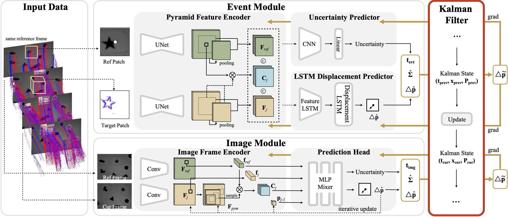
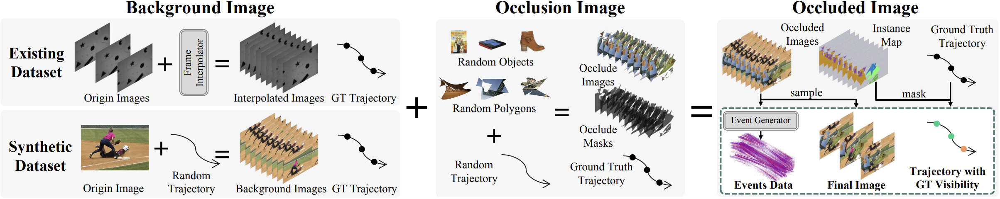

<div align="center">
<h1>BlinkTrack & MultiTrack (ICCV 2025)</h1>
<h3>BlinkTrack: Feature Tracking over 80 FPS via Events and Images</h3>

<!-- [Yichen Shen](https://scholar.google.com/citations?view_op=list_works&hl=en&user=LFa-H2cAAAAJ)<sup>1</sup>, [xxx](http)<sup>1</sup>,

<sup>1</sup> Zhejiang University, <sup>2</sup> XXX -->

[](https://arxiv.org/abs/2409.17981)
<!-- [](https://)
[](https://) -->

</div>


## Abstract


Event cameras, known for their high temporal resolution and ability to capture asynchronous changes, have gained significant attention for their potential in feature tracking, especially in challenging conditions. However, event cameras lack the fine-grained texture information that conventional cameras provide, leading to error accumulation in tracking. To address this, we propose a novel framework, BlinkTrack, which integrates event data with grayscale images for high-frequency feature tracking. Our method extends the traditional Kalman filter into a learning-based framework, utilizing differentiable Kalman filters in both event and image branches. This approach improves single-modality tracking and effectively solves the data association and fusion from asynchronous event and image data. We also introduce new synthetic and augmented datasets to better evaluate our model. Experimental results indicate that BlinkTrack significantly outperforms existing methods, exceeding 80 FPS with multi-modality data and 100 FPS with preprocessed event data.


## News

- **_News (2025-07-19)_**: 🎉🎉🎉 We release the init version of BlinkTrack! Further updates will be available soon!

## Todo

- [] Release the the camera-ready version of the paper and supplementary materials
- [] Release the pretrained weights and complete usage guide for BlinkTrack
- [] Release the data generation code and full documentation for MultiTrack
- [] Release the MultiTrack dataset

## Citation

If this work is helpful for your research, please consider citing the following BibTeX entry.

```
@misc{shen2024blinktrackfeaturetracking100,
      title={BlinkTrack: Feature Tracking over 100 FPS via Events and Images}, 
      author={Yichen Shen and Yijin Li and Shuo Chen and Guanglin Li and Zhaoyang Huang and Hujun Bao and Zhaopeng Cui and Guofeng Zhang},
      year={2024},
      eprint={2409.17981},
      archivePrefix={arXiv},
      primaryClass={cs.CV},
      url={https://arxiv.org/abs/2409.17981}, 
}
```

## Content

[BlinkTrack](#blinktrack)

1. [Introduction](#introduction)

[MultiTrack](#multitrack)

1. [Introduction](#introduction-1)

# BlinkTrack

## Introduction

BlinkTrack is a Kalman-filter-based framework for feature tracking that effectively solves the data association and fusion
from asynchronous event data and image data.

# MultiTrack
## Introduction

MultiTrack is a dataset with color images, events, occluded tracks and visibility status.


---

## Acknowledgments

Our work is standing on the shoulders of giants. We want to thank the following contributors that our code is based on:

- Deep-Ev-Tracker
https://github.com/uzh-rpg/deep_ev_tracker
- RAFT
https://github.com/princeton-vl/RAFT


